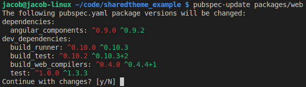

# pubspec_update

Update dependencies in pubspec.yaml to their latest versions.

## Installing

The recommended way to get this package is through [pub global](https://www.dartlang.org/tools/pub/cmd/pub-global).

```sh
# installs `pubspec-updater` (note the hyphen)
> pub global activate pubspec_updater
```

## Usage

```sh
Usage: pubspec-update [arguments] [directory]

arguments
-c, --confirm    Update packages without prompting the user for confirmation.
-f, --force      Equivalent to --upgrade --confirm.
-g, --get        Run `pub get` or `flutter packages get` on the package before processing.
-h, --help       Print this help message.
-s, --silent     Suppress all output.
-u, --upgrade    Run `pub upgrade` or `flutter packages upgrade` on the package before processing. Overrides --get.
```

## Screenshot



## How it works

`pubspec-update` only parses the `dependencies` and `dev_dependencies` blocks of `pubspec.yaml`. It looks only at packages with a version string on the same line as the package, including `any` and empty version strings.

```yaml
# All of these will be processed.
dependencies:
  intl: ^0.15.0
  frogs: any
  transmogrify:
  angular: '>=4.0.0 <5.0.0'
dev_dependencies:
  test: ^1.0.0
```

```yaml
# None of these will be processed
dependencies:
  intl:
    path: ../intl
  frogs:
    git: github.com/frog-database/frogs.git
  transmogrify:
    hosted:
      name: transmogrify
      url: http://some-package-server.com
    version: ^1.0.0
dev_dependencies:
  flutter_test:
    sdk: flutter

# Section ignored
dependency_overrides:
```

It will then read the `.packages` file to find the latest version of each package, creating the file if it doesn't exist. Using the `--get` or `--upgrade` arguments will first run `pub get` or `pub upgrade` (or flutter equivalent) before parsing the `.packages` file.

### Safety first

Before making any changes, it will show the user exactly what will change and give them a change to abort.

## Limitations

While it can read any version constraints (`">=1.0.0 <2.0.0"`), it always uses [caret syntax](https://www.dartlang.org/tools/pub/dependencies#caret-syntax) (`^1.0.0`) when updating version constraint. This is because it is the most widely used format and because it is much harder to try and intelligently add min and max versions that consider pre-release and build suffixes.

Specifically, the exact version from `.packages` is prefixed with a caret (`^`) to become the new version.